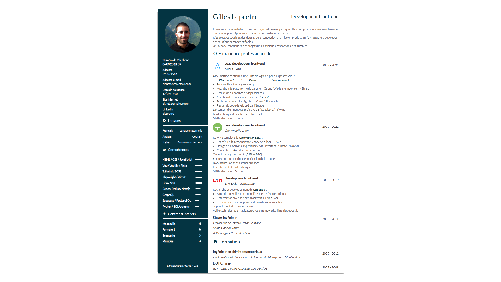

# resume

Pure HTML/CSS resume

## Requirements

* ∅ None, open the HTML in a modern browser.

## PDF Export

* Directly print from the browser

**[Download PDF 📄](https://raw.githubusercontent.com/glepretre/resume/main/dist/CV%20Gilles%20Lepretre.pdf)**

NB: As this is the main use case, it is designed to be printed in A4 / Portrait.

## License

Copyright :copyright: 2022 - 2025 Gilles Lepretre - All Rights Reserved.

It is public, because it needs to be.
The HTML & CSS code and layout could be reused,  
but I don't want to open-source the personal data contained in the resume.
